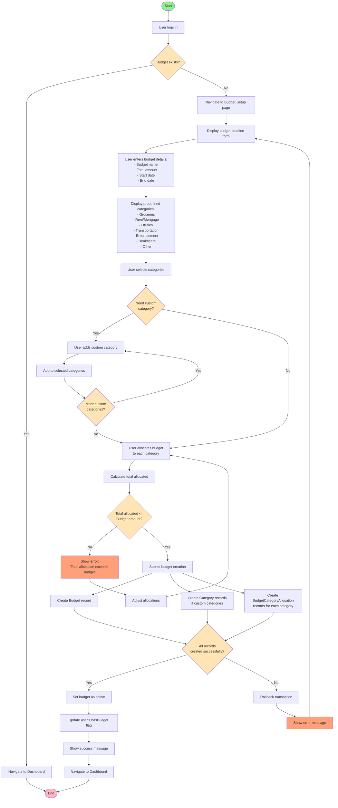

# Impulse - Budget Setup Activity Diagram

## Description

This activity diagram shows the complete workflow for setting up a new budget in the Impulse application.

### Key Workflows

#### 1. **Budget Existence Check**
- System checks if user already has a budget
- If yes → Navigate directly to dashboard
- If no → Proceed with budget setup

#### 2. **Budget Details Entry**
- User enters basic budget information:
  - Budget name
  - Total amount available
  - Start and end dates for budget period

#### 3. **Category Selection**
- System displays predefined categories
- User selects which categories to use
- Option to add custom categories
- Loop allows adding multiple custom categories

#### 4. **Budget Allocation**
- User allocates dollar amounts to each selected category
- System calculates total allocated
- Validation ensures total doesn't exceed budget amount
- If exceeds, user must adjust allocations

#### 5. **Database Transaction**
- Creates Budget record
- Creates any new custom Category records
- Creates BudgetCategoryAllocation records
- All operations in single transaction
- If any fails, entire operation rolls back

#### 6. **Completion**
- Budget marked as active
- User's hasBudget flag updated
- Success message shown
- User redirected to dashboard

### Important Notes

- **Transaction Safety**: All database operations occur in a transaction to ensure data consistency
- **Validation**: Multiple validation points prevent invalid data
- **User Experience**: Clear error messages guide users to fix issues
- **Flexibility**: Users can use predefined or custom categories
- **One-time Setup**: New users must complete this before using other features
