## Budget Setup and Transaction Recording Workflow

```mermaid
flowchart TD
    Start([User Logs In]) --> CheckBudget{Has Active<br/>Budget?}

    CheckBudget -->|No| CreateCategories[Create Default Categories<br/>Food, Transport, etc.]
    CreateCategories --> CreateBudget[Create Budget<br/>Set Amount & Period]
    CreateBudget --> AllocateCategories[Allocate Budget<br/>to Categories]
    AllocateCategories --> Dashboard[Go to Dashboard]

    CheckBudget -->|Yes| Dashboard

    Dashboard --> RecordTxn[Record New Transaction]
    RecordTxn --> EnterDetails[Enter Amount,<br/>Description, Date]
    EnterDetails --> SelectCategory[Select Category]
    SelectCategory --> CheckImpulse{Was this an<br/>Impulse Purchase?}

    CheckImpulse -->|Yes| MarkImpulse[Mark as Impulse<br/>Set is_impulse flag]
    CheckImpulse -->|No| SaveTxn[Save Transaction]
    MarkImpulse --> SaveTxn

    SaveTxn --> UpdateBudget[Update Budget Allocation<br/>Deduct from Category]
    UpdateBudget --> BroadcastUpdate[Broadcast via WebSocket<br/>to All Connected Clients]
    BroadcastUpdate --> CheckOverBudget{Category<br/>Over Budget?}

    CheckOverBudget -->|Yes| ShowWarning[Show Warning<br/>Notification]
    CheckOverBudget -->|No| ShowSuccess[Show Success<br/>Message]

    ShowWarning --> UpdateDashboard[Update Dashboard<br/>Refresh Metrics]
    ShowSuccess --> UpdateDashboard

    UpdateDashboard --> CheckStreak[Update Impulse-Free<br/>Streak Counter]
    CheckStreak --> End([Transaction Complete])

    style Start fill:#e1f5ff,stroke:#01579b,stroke-width:2px
    style End fill:#e1f5ff,stroke:#01579b,stroke-width:2px
    style CheckBudget fill:#fff9c4,stroke:#f57f17,stroke-width:2px
    style CheckImpulse fill:#fff9c4,stroke:#f57f17,stroke-width:2px
    style CheckOverBudget fill:#fff9c4,stroke:#f57f17,stroke-width:2px
    style MarkImpulse fill:#ffebee,stroke:#c62828,stroke-width:2px
    style ShowWarning fill:#ffebee,stroke:#c62828,stroke-width:2px
    style BroadcastUpdate fill:#e8f5e9,stroke:#2e7d32,stroke-width:2px
```

## Description

This activity diagram shows the **dynamic behavior** of the system through a complete workflow from login to transaction recording.

### Workflow Phases

#### Phase 1: Initial Setup (First-Time Users)
1. User logs in
2. System checks if user has an active budget
3. If no budget exists:
   - Create default spending categories
   - Create a new budget with amount and time period
   - Allocate budget amounts to each category

#### Phase 2: Transaction Recording
4. User navigates to dashboard
5. User initiates transaction recording
6. Enter transaction details:
   - Amount (e.g., $45.99)
   - Description (e.g., "Grocery shopping")
   - Date
7. Select spending category (e.g., Food)

#### Phase 3: Impulse Purchase Tracking
8. System asks: "Was this an impulse purchase?"
   - **Yes** → Mark transaction with `is_impulse = true` flag
   - **No** → Continue to save
9. Save transaction to database

#### Phase 4: Budget Updates and Notifications
10. System updates budget allocation:
    - Deducts amount from category's allocated budget
    - Recalculates remaining amounts
11. Broadcast update via WebSocket to all connected clients
12. Check if category is over budget:
    - **Over Budget** → Show warning notification
    - **Within Budget** → Show success message

#### Phase 5: Dashboard Updates
13. Refresh dashboard with updated metrics:
    - Total spending
    - Category breakdowns
    - Budget progress bars
14. Update impulse-free streak counter
15. Transaction complete

### Decision Points (Diamond Shapes)

1. **Has Active Budget?** - Determines if onboarding is needed
2. **Was this an Impulse Purchase?** - Allows user to self-identify impulse spending
3. **Category Over Budget?** - Triggers warning system

### Key Behaviors Demonstrated

- **Onboarding Flow**: First-time users are guided through budget setup
- **Data Validation**: Transaction details are validated before saving
- **Real-time Updates**: WebSocket broadcasts keep all clients synchronized
- **Budget Monitoring**: Automatic over-budget detection
- **Impulse Tracking**: Self-reporting mechanism for behavioral insights
- **Streak Calculation**: Gamification to encourage mindful spending

### System Responses to Events

- **Event: User logs in** → Response: Check budget status
- **Event: No budget exists** → Response: Trigger setup wizard
- **Event: Transaction saved** → Response: Update allocations and broadcast
- **Event: Over budget** → Response: Display warning
- **Event: Impulse marked** → Response: Update streak counter

### Color Legend

- **Blue**: Start/End points
- **Yellow**: Decision points
- **Red**: Impulse-related or warning actions
- **Green**: Real-time synchronization actions
