# Impulse - Impulse Purchase Analysis Activity Diagram

```mermaid
flowchart TD
    Start([Start]) --> Navigate[Navigate to Dashboard]
    Navigate --> InitLoad[Initialize dashboard loading]

    InitLoad --> QueryTransactions[Query current month transactions]

    QueryTransactions --> CalcImpulses[Calculate Impulses Resisted:<br/>Count transactions where<br/>is_impulse = true AND<br/>transaction_date >= month_start]
    CalcImpulses --> StoreImpulses[Store as impulsesResistedThisMonth]

    QueryTransactions --> CalcSaved[Calculate Total Saved from Abandoned:<br/>Query all user transactions<br/>Filter containing keywords:<br/>- 'abandon' case-insensitive<br/>- 'resist' case-insensitive<br/>Sum amounts of filtered transactions]
    CalcSaved --> StoreSaved[Store as totalSavedFromAbandoned]

    QueryTransactions --> CalcStreak[Calculate Impulse Streak:<br/>Set current_date = today<br/>Set streak_count = 0<br/>Set max_days_to_check = 3650]
    CalcStreak --> LoopDays{streak_count <<br/>max_days_to_check?}

    LoopDays -->|Yes| CheckDay[Check if current_date has<br/>transactions with is_impulse = true]
    CheckDay --> HasImpulse{Has impulse<br/>purchase?}

    HasImpulse -->|Yes| StoreStreak[Store as streakDaysWithoutImpulse]
    HasImpulse -->|No| IncrementStreak[Increment streak_count<br/>Decrement current_date by 1 day]
    IncrementStreak --> LoopDays

    LoopDays -->|No| StoreStreak

    QueryTransactions --> CalcCategory[Calculate Spending by Category:<br/>Query all transactions<br/>excluding abandoned ones<br/>Filter out transactions<br/>with 'abandon' keyword<br/>Group by category_id<br/>Calculate SUM amount per category]
    CalcCategory --> StoreCategory[Store as spendingByCategory]

    StoreImpulses --> Aggregate
    StoreSaved --> Aggregate
    StoreStreak --> Aggregate
    StoreCategory --> Aggregate[Aggregate all metrics]

    Aggregate --> ReturnData[Return dashboard data]
    ReturnData --> ReceiveData[Receive dashboard data]

    ReceiveData --> RenderCards[Render metric cards:<br/>- Impulses Resisted This Month<br/>- Total Saved from Abandoned<br/>- Days Without Impulse Streak<br/>- Spending by Category Chart]

    RenderCards --> ViewMetrics[View impulse metrics]
    ViewMetrics --> WantDetail{Want detailed<br/>impulse analysis?}

    WantDetail -->|No| End([End])

    WantDetail -->|Yes| ClickAnalysis[Click on 'Impulse Analysis'<br/>chart/link]
    ClickAnalysis --> RequestAnalysis[Request GET<br/>/api/analytics/impulse-analysis/]

    RequestAnalysis --> QueryAll[Query all user transactions]

    QueryAll --> CalcImpulseSpend[Calculate impulse_spending:<br/>SUM amount WHERE is_impulse = true]
    QueryAll --> CalcPlannedSpend[Calculate planned_spending:<br/>SUM amount WHERE is_impulse = false]
    QueryAll --> CountImpulse[Count impulse_count:<br/>COUNT * WHERE is_impulse = true]
    QueryAll --> CountPlanned[Count planned_count:<br/>COUNT * WHERE is_impulse = false]

    CalcImpulseSpend --> CalcTotal
    CalcPlannedSpend --> CalcTotal
    CountImpulse --> CalcTotal
    CountPlanned --> CalcTotal[Calculate total_spending =<br/>impulse_spending + planned_spending]

    CalcTotal --> CheckTotal{total_spending > 0?}

    CheckTotal -->|Yes| CalcPercentage[Calculate impulse_percentage =<br/>impulse_spending / total_spending * 100]
    CheckTotal -->|No| SetZero[Set impulse_percentage = 0]

    CalcPercentage --> ReturnAnalysis
    SetZero --> ReturnAnalysis[Return analysis data]

    ReturnAnalysis --> RenderViz[Render impulse analysis visualizations:<br/>- Pie chart Impulse vs Planned<br/>- Percentage indicator<br/>- Transaction counts<br/>- Spending amounts]

    RenderViz --> AnalyzePatterns[Analyze impulse spending patterns]
    AnalyzePatterns --> IdentifyProblems{Identify<br/>problem areas?}

    IdentifyProblems -->|No| UseInsights

    IdentifyProblems -->|Yes| ReviewTransactions[Review specific impulse transactions]
    ReviewTransactions --> ClickView[Click 'View Impulse Transactions']
    ClickView --> RequestList[Request GET<br/>/api/transactions/impulse/]

    RequestList --> QueryImpulse[Query transactions<br/>WHERE is_impulse = true<br/>Order by transaction_date DESC]
    QueryImpulse --> DisplayList[Display list of impulse purchases]

    DisplayList --> ReviewEach[Review each impulse purchase]
    ReviewEach --> WantUnmark{Want to unmark<br/>some?}

    WantUnmark -->|No| UseInsights

    WantUnmark -->|Yes| SelectTxn[Select transaction]
    SelectTxn --> ClickUnmark[Click 'Unmark as Impulse']
    ClickUnmark --> UpdateFlag[Update is_impulse = false]
    UpdateFlag --> RefreshList[Refresh impulse list]
    RefreshList --> RefreshMetrics[Update dashboard metrics]
    RefreshMetrics --> ReviewEach

    UseInsights[Use insights to improve<br/>spending behavior]
    UseInsights --> End

    style Start fill:#90EE90
    style End fill:#FFB6C1
    style LoopDays fill:#FFE4B5
    style HasImpulse fill:#FFE4B5
    style WantDetail fill:#FFE4B5
    style CheckTotal fill:#FFE4B5
    style IdentifyProblems fill:#FFE4B5
    style WantUnmark fill:#FFE4B5
    style CalcImpulses fill:#E6F3FF
    style CalcSaved fill:#E6F3FF
    style CalcStreak fill:#E6F3FF
    style CalcCategory fill:#E6F3FF
```

## Description

This activity diagram shows how the Impulse application calculates, displays, and enables users to analyze their impulse purchase patterns.

### Key Workflows

#### 1. **Dashboard Metrics Calculation** (Parallel Processing)

**Impulses Resisted This Month:**
- Count all transactions marked as impulse in current month
- Provides visibility into impulse buying frequency

**Total Saved from Abandoned:**
- Query all transactions
- Filter for "abandon" or "resist" keywords in notes/description
- Sum amounts to show money saved by resisting purchases
- Heuristic-based detection (no database flag)

**Impulse Streak:**
- Iterate backward from today
- Check each day for impulse purchases
- Count consecutive days without impulse buying
- Stops at first day with impulse purchase
- Safety limit: 3650 days (10 years)

**Spending by Category:**
- Aggregate spending grouped by category
- Exclude abandoned purchases from totals
- Provides breakdown of actual spending

#### 2. **Dashboard Display**
- All metrics rendered as cards/charts
- Visual representation of impulse patterns
- Quick overview of spending behavior

#### 3. **Detailed Impulse Analysis**
- User can drill down for more details
- Calculates:
  - Total impulse spending
  - Total planned spending
  - Impulse percentage
  - Transaction counts for each type
- Visualizations:
  - Pie chart (Impulse vs Planned)
  - Percentage indicators
  - Count comparisons

#### 4. **Transaction Review & Correction**
- View all impulse purchases
- Sorted by date (most recent first)
- Option to unmark misclassified transactions
- Real-time metric updates after changes

### Important Notes

- **Parallel Calculations**: Dashboard metrics calculated concurrently for performance
- **Heuristic Detection**: "Abandoned" purchases detected via keywords, not database flag
- **Streak Motivation**: Days-without-impulse streak encourages behavior change
- **Self-Correction**: Users can reclassify transactions if initially marked incorrectly
- **Visual Analytics**: Charts and graphs make patterns easy to identify
- **Actionable Insights**: Data helps users understand and modify spending habits

### Business Value

1. **Awareness**: Users see how often they make impulse purchases
2. **Motivation**: Streak counter encourages avoiding impulse buying
3. **Savings**: Shows actual money saved by resisting purchases
4. **Patterns**: Category breakdown reveals problem areas
5. **Accountability**: Visual data makes spending patterns concrete
