# Impulse - Transaction Recording Activity Diagram

```mermaid
flowchart TD
    Start([Start]) --> Navigate[Navigate to Transactions page]
    Navigate --> ClickAdd[Click 'Add Transaction' button]
    ClickAdd --> DisplayForm[Display transaction form]

    DisplayForm --> FillDetails[Fill transaction details:<br/>- Amount<br/>- Description<br/>- Notes optional]
    FillDetails --> SelectCategory[Select category from dropdown]
    SelectCategory --> SelectBudget[Select budget optional]
    SelectBudget --> SetDate[Set transaction date/time]

    SetDate --> IsImpulse{Is this an<br/>impulse purchase?}

    IsImpulse -->|Yes| CheckImpulse[Check 'Impulse Purchase' checkbox]
    CheckImpulse --> DecideResist{Decided to<br/>resist/abandon?}

    DecideResist -->|Yes| AddKeyword[Add 'abandon' or 'resist'<br/>keyword in notes or description]
    AddKeyword --> SubmitForm

    DecideResist -->|No| SubmitForm[Submit transaction form]

    IsImpulse -->|No| LeaveUnchecked[Leave impulse checkbox unchecked]
    LeaveUnchecked --> SubmitForm

    SubmitForm --> ValidateForm[Validate form data:<br/>- Amount > 0<br/>- Description not empty<br/>- Category selected]

    ValidateForm --> FormValid{Validation<br/>passed?}

    FormValid -->|No| ShowValidation[Show validation errors]
    ShowValidation --> FillDetails

    FormValid -->|Yes| SendPost[Send POST request to<br/>/api/transactions/]
    SendPost --> Authenticate[Authenticate user via JWT]

    Authenticate --> IsAuth{Authenticated?}

    IsAuth -->|No| Return401[Return 401 Unauthorized]
    Return401 --> RedirectLogin[Redirect to login]
    RedirectLogin --> End([End])

    IsAuth -->|Yes| ValidateCategory[Validate category<br/>belongs to user]

    ValidateCategory --> CategoryValid{Category<br/>valid?}

    CategoryValid -->|No| Return400Cat[Return 400 Bad Request]
    Return400Cat --> ShowError1[Show error message]
    ShowError1 --> End

    CategoryValid -->|Yes| BudgetSelected{Budget<br/>selected?}

    BudgetSelected -->|Yes| ValidateBudget[Validate budget<br/>belongs to user]
    ValidateBudget --> BudgetValid{Budget<br/>valid?}

    BudgetValid -->|No| Return400Bud[Return 400 Bad Request]
    Return400Bud --> ShowError2[Show error message]
    ShowError2 --> End

    BudgetValid -->|Yes| CreateRecord
    BudgetSelected -->|No| CreateRecord[Create Transaction<br/>record in database]

    CreateRecord --> TriggerSignal[Trigger post_save signal]

    TriggerSignal --> SerializeData[Serialize transaction data]
    SerializeData --> LinkedToBudget{Transaction<br/>linked to budget?}

    LinkedToBudget -->|Yes| CalculateMetrics[Calculate updated budget metrics:<br/>- total_spent<br/>- remaining]
    CalculateMetrics --> Broadcast

    LinkedToBudget -->|No| Broadcast[Broadcast via WebSocket<br/>to user's transaction group]

    Broadcast --> SendRealTime[Send real-time update to<br/>all connected clients]
    SendRealTime --> Return201[Return 201 Created<br/>with transaction data]

    Return201 --> UpdateList[Update local transaction list]
    UpdateList --> BudgetLinked2{Budget<br/>linked?}

    BudgetLinked2 -->|Yes| UpdateBudget[Update budget display<br/>with new totals]
    UpdateBudget --> ShowSuccess

    BudgetLinked2 -->|No| ShowSuccess[Show success notification]

    ShowSuccess --> ClearForm[Clear form]
    ClearForm --> ViewList[View updated transaction list]
    ViewList --> End

    style Start fill:#90EE90
    style End fill:#FFB6C1
    style IsImpulse fill:#FFE4B5
    style DecideResist fill:#FFE4B5
    style FormValid fill:#FFE4B5
    style IsAuth fill:#FFE4B5
    style CategoryValid fill:#FFE4B5
    style BudgetSelected fill:#FFE4B5
    style BudgetValid fill:#FFE4B5
    style LinkedToBudget fill:#FFE4B5
    style BudgetLinked2 fill:#FFE4B5
    style AddKeyword fill:#90EE90
    style Broadcast fill:#87CEEB
    style SendRealTime fill:#87CEEB
```

## Description

This activity diagram illustrates the complete workflow for recording a transaction with impulse purchase detection and real-time updates.

### Key Workflows

#### 1. **Form Entry**
- User navigates to transactions page
- Clicks to add new transaction
- Fills in required details:
  - Amount (required, must be > 0)
  - Description (required)
  - Notes (optional)
  - Category (required)
  - Budget (optional)
  - Transaction date/time

#### 2. **Impulse Purchase Handling**
- User can mark transaction as impulse purchase
- If marked as impulse:
  - Can add "abandon" or "resist" keywords
  - These transactions count toward savings metrics
  - Tracked separately for analytics

#### 3. **Validation**
- **Client-side**: Form data validated before submission
- **Server-side**: Multiple validation checks:
  - User authentication via JWT
  - Category ownership verification
  - Budget ownership verification (if selected)
  - Amount must be positive

#### 4. **Database & Signal Processing**
- Transaction record created
- Django post_save signal automatically triggered
- Transaction data serialized
- If linked to budget, budget metrics recalculated

#### 5. **Real-time Broadcasting**
- WebSocket broadcast to user's transaction group
- All connected clients receive update
- Includes both transaction and budget data
- Updates appear instantly on all devices

#### 6. **UI Updates**
- Transaction list refreshed
- Budget display updated with new totals
- Success notification shown
- Form cleared for next entry

### Important Notes

- **Real-time Sync**: All connected clients (tabs/devices) receive updates via WebSocket
- **Impulse Tracking**: Enables users to track and analyze impulsive spending patterns
- **Abandoned Purchases**: Keywords like "abandon" or "resist" indicate money saved
- **Multi-device**: Changes appear immediately across all logged-in devices
- **Budget Tracking**: When linked to budget, spending updates instantly
- **Security**: Multiple validation layers prevent unauthorized data access
