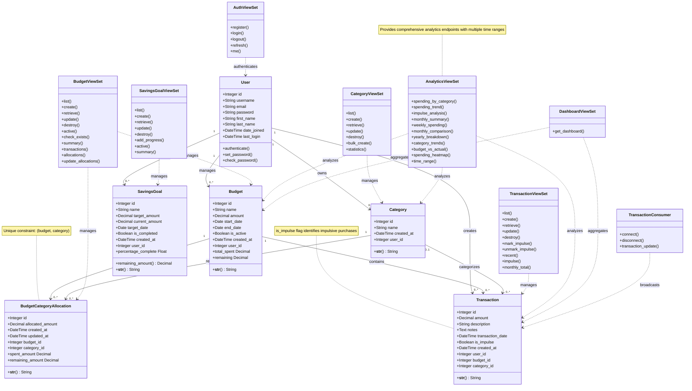

# Impulse - Class Diagram

## Description

This class diagram shows the complete static structure of the Impulse application including:

- **Core Models**: All database entities with their attributes and methods
- **ViewSets**: API controllers that manage the models
- **Relationships**: One-to-many and foreign key relationships between entities
- **WebSocket Consumer**: Real-time update handler

### Key Relationships

- Users own all their financial data (Categories, Budgets, Transactions, SavingsGoals)
- Transactions can optionally link to a Budget and Category
- Budgets have multiple category allocations that track spending per category
- The is_impulse boolean flag on Transaction enables impulse purchase tracking
