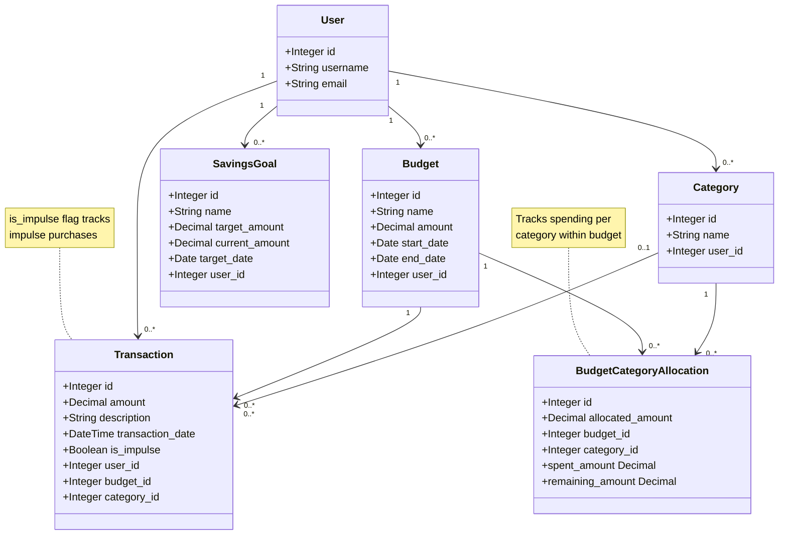

## Class Diagram

## Core Data Models

This simplified class diagram shows the **6 core models** in the Impulse application:

### 1. User
Django's built-in user model for authentication

### 2. Category
Spending categories (e.g., Food, Transport, Entertainment)
- User-specific categories
- Used for organizing transactions

### 3. Budget
Budget periods with total amounts
- Start and end dates define the budget period
- Users can have multiple budgets (current and past)

### 4. Transaction
Individual financial transactions (expenses)
- Links to optional Budget and Category
- `is_impulse` flag identifies impulse purchases

### 5. BudgetCategoryAllocation
Allocates budget amounts to specific categories
- Each budget can allocate funds to multiple categories
- Computed properties: `spent_amount`, `remaining_amount`
- Enforces unique (budget, category) pairs

### 6. SavingsGoal
Savings goals users want to achieve
- Track progress toward target amounts
- Target dates for motivation

### Key Relationships

- **User → Everything**: All data is user-scoped
- **Budget → Allocations**: One budget has many category allocations
- **Budget → Transactions**: Transactions optionally link to a budget
- **Category → Transactions**: Transactions optionally link to a category
- **Category → Allocations**: Categories receive budget allocations

### Important Notes

- `Transaction.budget_id` and `Transaction.category_id` use `SET_NULL` on delete to preserve transaction history
- `BudgetCategoryAllocation` has a unique constraint on (budget, category)
