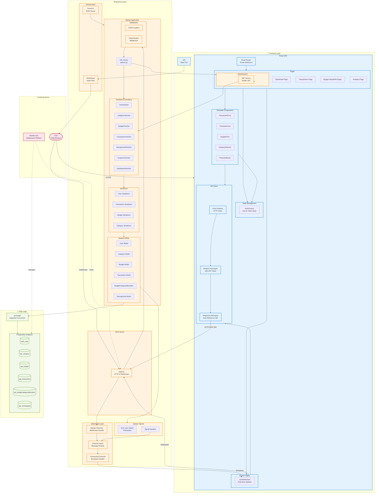

# Impulse - Component Diagram



## Description

This component diagram illustrates the complete system architecture of the Impulse application, showing all major components and their interactions across four layers.

### Architecture Overview

The Impulse application follows a **Full-Stack Monorepo** pattern with clear separation between frontend, backend, data, and infrastructure layers.

---

## Layer Details

### 🎨 Frontend Layer

#### **React SPA**
Single Page Application built with React 18.2.0

**Components:**
- **Router**: React Router DOM 6.20.0
  - Handles client-side routing
  - Protected route management
  - Navigation between pages

- **Pages**: Top-level route components
  - Dashboard: Metrics and overview
  - Transactions: CRUD operations
  - Budget Setup/Edit: Budget management
  - Analytics: Charts and visualizations
  - Auth Pages: Login/SignUp

- **Reusable Components**: Shared UI elements
  - TransactionForm, TransactionList
  - BudgetForm, CategorySelector
  - ProtectedRoute wrapper

- **State Management**:
  - **AuthContext**: User authentication state
    - Current user info
    - JWT tokens
    - hasBudget flag
  - React Context API for global state

- **Custom Hooks**:
  - **useWebSocket**: Real-time update subscription
    - Connects to user's WebSocket group
    - Handles transaction/budget updates
    - Auto-reconnection

- **API Client**:
  - **Axios Instance**: Configured HTTP client
  - **Request Interceptor**: Automatically adds JWT token to headers
  - **Response Interceptor**: Auto-refresh on 401 Unauthorized

#### **Vite**
Modern build tool for development and production builds
- Hot Module Replacement (HMR)
- Fast refresh during development
- Optimized production builds

**Technology Stack:**
- React 18.2.0
- React Router DOM 6.20.0
- Axios 1.6.0
- Tailwind CSS 3.4.18
- Vite 7.1.9

---

### ⚙️ Backend Layer

#### **ASGI Server - Daphne**
Handles both HTTP and WebSocket connections
- HTTP/HTTPS request routing
- WebSocket persistent connections
- Production-ready async server

#### **Django Application**

**URL Router:**
- Routes requests to appropriate ViewSets
- RESTful endpoint definitions
- Located in `api/urls.py`

**ViewSets (Controllers):**
REST API endpoints for each resource:
- **AuthViewSet**: Registration, login, logout, refresh, profile
- **CategoryViewSet**: Category CRUD + statistics
- **BudgetViewSet**: Budget CRUD + allocations + summary
- **TransactionViewSet**: Transaction CRUD + impulse marking + filtering
- **SavingsGoalViewSet**: Goal CRUD + progress tracking
- **AnalyticsViewSet**: Multiple analytics endpoints
- **DashboardViewSet**: Dashboard metrics aggregation

**Serializers:**
Data validation and transformation layer:
- Input validation
- Output formatting
- Nested serialization
- Custom field handling

**Models (ORM):**
Database entities with business logic:
- User (Django built-in)
- Category, Budget, Transaction
- BudgetCategoryAllocation
- SavingsGoal

**Authentication:**
- **JWT Service**: Simple JWT library
  - Token generation
  - Token verification
  - Access token (1 hour)
  - Refresh token (7 days)

**Middleware:**
- **CORS Headers**: Cross-origin request handling
- **Authentication**: JWT verification on protected routes

#### **WebSocket Layer**

**Django Channels:**
- WebSocket protocol handler
- Async/await support
- Channel routing

**Channel Layers:**
- In-memory (development)
- Redis-backed (production recommended)
- Message routing between consumers

**TransactionConsumer:**
- Handles WebSocket connections
- Authenticates via JWT
- Creates per-user groups (`transactions_group_{user_id}`)
- Broadcasts updates to all connected clients

#### **Django Signals**

**post_save Signal:**
- Triggers on Transaction save
- Serializes data
- Calculates budget impacts
- Sends to Channel Layer for WebSocket broadcast

**Workflow:**
```
Transaction saved → Signal fired → Data serialized →
Channel Layer → Consumer → WebSocket → All clients updated
```

#### **Infrastructure**

**WhiteNoise:**
- Static file serving
- Optimized for production
- CDN-ready

**Gunicorn:**
- WSGI server for production HTTP
- Multiple worker processes
- Load balancing

**Technology Stack:**
- Django 5.2.7
- Django REST Framework 3.16.1
- Django Channels 4.3.1
- Simple JWT 5.5.1
- Daphne 4.2.1
- Gunicorn 23.0.0
- psycopg2-binary 2.9.11

---

### 💾 Data Layer

#### **PostgreSQL Database**

**Tables:**
- `auth_user`: User accounts
- `api_category`: Expense categories
- `api_budget`: Budget records
- `api_transaction`: Financial transactions
- `api_budgetcategoryallocation`: Budget allocations per category
- `api_savingsgoal`: Savings goal tracking

**Features:**
- ACID compliance
- Foreign key constraints
- Indexes on frequently queried fields
- Managed by Render.com in production

#### **Database Connection**

**psycopg2:**
- PostgreSQL adapter for Python
- Connection pooling
- Prepared statements
- Thread-safe

**dj-database-url:**
- Database URL parsing
- Environment variable configuration
- Easy deployment configuration

---

### 🔄 Data Flow

#### **HTTP Request Flow**
```
User → React → Axios (+ JWT) → ASGI → Middleware →
URLRouter → ViewSet → Serializer → Model → Database
```

#### **HTTP Response Flow**
```
Database → Model → Serializer → ViewSet →
ASGI → Axios → React → User
```

#### **WebSocket Update Flow**
```
Transaction Saved → Django Signal → Channel Layer →
TransactionConsumer → WebSocket → All Connected Clients
```

#### **Authentication Flow**
```
User Login → AuthViewSet → JWT Service →
Tokens Generated → Stored in localStorage →
Added to every request via Interceptor
```

---

### 🚀 Deployment Architecture

**Render.com:**
- **Web Service**: Hosts ASGI application (Daphne)
- **Database**: Managed PostgreSQL instance
- **Environment Variables**: Configuration management
- **Automatic Deployments**: CI/CD from git push

**Production Setup:**
```
Internet → Render Load Balancer →
Daphne (ASGI) → Django → PostgreSQL
```

---

### 🔐 Security Features

1. **JWT Authentication**: Stateless token-based auth
2. **CORS Protection**: Whitelisted origins only
3. **HTTPS**: Encrypted communication
4. **Password Hashing**: bcrypt via Django
5. **SQL Injection Protection**: Django ORM parameterized queries
6. **XSS Protection**: React escaping + Django templates
7. **CSRF Protection**: Django middleware (API uses JWT)

---

### 📊 Performance Features

1. **Parallel API Calls**: Dashboard loads multiple endpoints simultaneously
2. **Real-time Updates**: WebSocket eliminates polling
3. **Token Refresh**: Transparent, no user interruption
4. **Database Indexing**: Optimized queries
5. **Static File Caching**: WhiteNoise with cache headers
6. **Code Splitting**: Vite bundle optimization

---

### 🔧 Development vs Production

| Component | Development | Production |
|-----------|-------------|------------|
| Database | SQLite | PostgreSQL (Render) |
| Static Files | Vite dev server | WhiteNoise |
| ASGI Server | Daphne (dev mode) | Daphne (production) |
| Channel Layers | In-memory | Redis (recommended) |
| Frontend | Vite dev server | Built static files |
| Environment | localhost:5173, :8000 | Render.com domains |

---

## Technology Summary

### Frontend
- React 18.2.0 + React Router 6.20.0
- Axios 1.6.0 (HTTP client)
- Tailwind CSS 3.4.18 (styling)
- Vite 7.1.9 (build tool)

### Backend
- Django 5.2.7 + DRF 3.16.1
- Django Channels 4.3.1 (WebSocket)
- Simple JWT 5.5.1 (authentication)
- Daphne 4.2.1 (ASGI server)

### Database
- PostgreSQL (production)
- SQLite (development)

### Deployment
- Render.com platform
- Gunicorn + Daphne servers
- WhiteNoise static files
