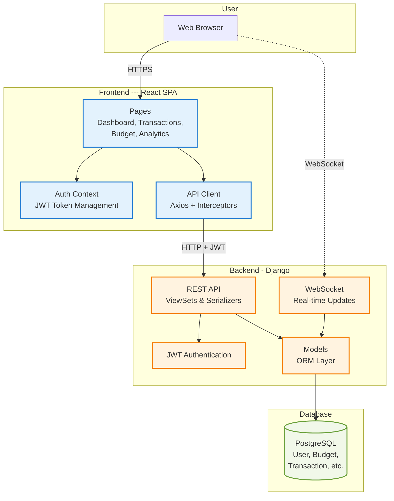

## Component Diagram

## Architecture Overview

The Impulse application uses a **3-tier architecture**:

### Frontend Layer
- **React SPA** with React Router for navigation
- **Auth Context** manages user state and JWT tokens
- **API Client** handles all HTTP requests with automatic token refresh

###  Backend Layer
- **Django REST Framework** provides RESTful API endpoints
- **JWT Authentication** secures all API calls
- **WebSocket** enables real-time transaction updates
- **Django ORM** manages database operations

###  Data Layer
- **PostgreSQL** stores all user data
- Tables: User, Category, Budget, Transaction, SavingsGoal, etc.

### Data Flow

**HTTP Request:** Browser → React → Axios (+ JWT) → Django REST API → Database

**WebSocket:** Transaction saved → Django Signal → WebSocket → All connected clients