# Impulse - Analytics & Dashboard Data Loading Sequence

```mermaid
sequenceDiagram
    autonumber
    actor User
    participant Frontend as React Frontend
    participant API as API Client
    participant Dashboard as DashboardViewSet
    participant Analytics as AnalyticsViewSet
    participant DB as Database

    User->>Frontend: Navigate to Dashboard
    activate Frontend

    Frontend->>Frontend: useEffect() triggered

    par Parallel API Call 1: Dashboard Metrics
        Frontend->>API: GET /api/dashboard/
        activate API
        API->>Dashboard: get_dashboard(request)
        activate Dashboard

        Dashboard->>DB: Get current month transactions
        activate DB

        Note over Dashboard,DB: Query 1: Calculate totalSavedFromAbandoned<br/>SELECT SUM(amount) FROM transaction<br/>WHERE (notes ILIKE '%abandon%' OR description ILIKE '%abandon%'<br/>OR notes ILIKE '%resist%' OR description ILIKE '%resist%')<br/>AND user_id = ?

        DB-->>Dashboard: abandoned_sum

        Note over Dashboard,DB: Query 2: Count impulses this month<br/>SELECT COUNT(*) FROM transaction<br/>WHERE is_impulse = true<br/>AND transaction_date >= start_of_month<br/>AND user_id = ?

        DB-->>Dashboard: impulse_count

        Note over Dashboard,DB: Query 3: Spending by category<br/>SELECT category_id, SUM(amount)<br/>FROM transaction<br/>WHERE user_id = ?<br/>AND NOT (notes ILIKE '%abandon%' OR description ILIKE '%abandon%')<br/>GROUP BY category_id

        DB-->>Dashboard: spending_by_category

        Dashboard->>Dashboard: Calculate streak_days_without_impulse:<br/>Iterate backward from today,<br/>count consecutive days without impulse

        Dashboard->>DB: Check each day for impulse transactions
        DB-->>Dashboard: impulse_exists per day

        deactivate DB

        Dashboard-->>API: {totalSavedFromAbandoned,<br/>impulsesResistedThisMonth,<br/>spendingByCategory[],<br/>streakDaysWithoutImpulse}
        deactivate Dashboard
        API-->>Frontend: Dashboard data
        deactivate API

    and Parallel API Call 2: Budget Summary
        Frontend->>API: GET /api/budgets/summary/
        activate API
        API->>Dashboard: (BudgetViewSet) summary()
        activate Dashboard

        Dashboard->>DB: Get active budgets with allocations
        activate DB

        Note over Dashboard,DB: SELECT * FROM budget<br/>LEFT JOIN budget_category_allocation<br/>WHERE user_id = ? AND is_active = true

        DB-->>Dashboard: budgets with allocations
        deactivate DB

        Dashboard->>Dashboard: Calculate per budget:<br/>- total_spent (sum of transactions)<br/>- remaining (amount - total_spent)

        Dashboard->>Dashboard: Calculate per allocation:<br/>- spent_amount<br/>- remaining_amount

        Dashboard-->>API: {budgets: [{id, name, amount,<br/>total_spent, remaining,<br/>allocations: [...]}]}
        deactivate Dashboard
        API-->>Frontend: Budget summary
        deactivate API

    and Parallel API Call 3: Monthly Analytics
        Frontend->>API: GET /api/analytics/monthly-summary/
        activate API
        API->>Analytics: monthly_summary()
        activate Analytics

        Analytics->>DB: Get current month data
        activate DB

        Note over Analytics,DB: Multiple aggregations:<br/>1. Total spending<br/>2. Impulse vs planned spending<br/>3. Category breakdown<br/>4. Daily averages<br/>5. Budget utilization

        DB-->>Analytics: Aggregated data
        deactivate DB

        Analytics-->>API: {total_spending,<br/>impulse_spending,<br/>planned_spending,<br/>category_breakdown[],<br/>average_daily_spending,<br/>budget_utilization}
        deactivate Analytics
        API-->>Frontend: Monthly summary
        deactivate API

    and Parallel API Call 4: Savings Goals
        Frontend->>API: GET /api/savings-goals/summary/
        activate API
        API->>Analytics: (SavingsGoalViewSet) summary()
        activate Analytics

        Analytics->>DB: Get all savings goals
        activate DB

        Note over Analytics,DB: SELECT * FROM savings_goal<br/>WHERE user_id = ?

        DB-->>Analytics: Savings goals
        deactivate DB

        Analytics->>Analytics: Calculate:<br/>- total_target<br/>- total_current<br/>- total_remaining<br/>- overall_percentage

        Analytics-->>API: {goals: [...],<br/>total_target,<br/>total_current,<br/>total_remaining,<br/>overall_percentage}
        deactivate Analytics
        API-->>Frontend: Savings summary
        deactivate API
    end

    Frontend->>Frontend: Aggregate all data
    Frontend->>Frontend: Render dashboard widgets:<br/>- Budget overview cards<br/>- Spending charts<br/>- Impulse metrics<br/>- Savings progress<br/>- Recent transactions

    Frontend-->>User: Display complete dashboard
    deactivate Frontend

    Note over Frontend,DB: Dashboard makes parallel API calls<br/>to load multiple data sources<br/>simultaneously for better performance
```

## Description

This sequence diagram shows how the dashboard loads multiple data sources in parallel for optimal performance.

### Key Features

#### 1. **Parallel Loading**
- Four independent API calls made simultaneously
- Reduces total loading time significantly
- Better user experience with faster page load

#### 2. **Dashboard Metrics (Call 1)**
- **totalSavedFromAbandoned**: Sum of transactions with "abandon" or "resist" keywords
- **impulsesResistedThisMonth**: Count of impulse purchases this month
- **spendingByCategory**: Spending breakdown excluding abandoned purchases
- **streakDaysWithoutImpulse**: Consecutive days without impulse buying

#### 3. **Budget Summary (Call 2)**
- Active budgets with all allocations
- Total spent per budget (calculated from transactions)
- Remaining budget amounts
- Per-category spending vs allocations

#### 4. **Monthly Analytics (Call 3)**
- Total spending for current month
- Impulse vs planned spending comparison
- Category breakdown
- Daily spending averages
- Budget utilization percentages

#### 5. **Savings Goals (Call 4)**
- All user savings goals
- Progress toward each goal
- Total targets and current amounts
- Overall completion percentage

### Important Notes

- **Performance**: Parallel calls complete in time of slowest call, not sum of all
- **Independence**: Each API call is independent and doesn't block others
- **Heuristic Detection**: "Abandoned" purchases detected by keywords in notes/description
- **Streak Calculation**: Iterates backward from today, stops at first impulse purchase
- **Real-time Updates**: Dashboard data refreshes when WebSocket updates received
- **Category Filtering**: Abandoned purchases excluded from spending by category calculations
