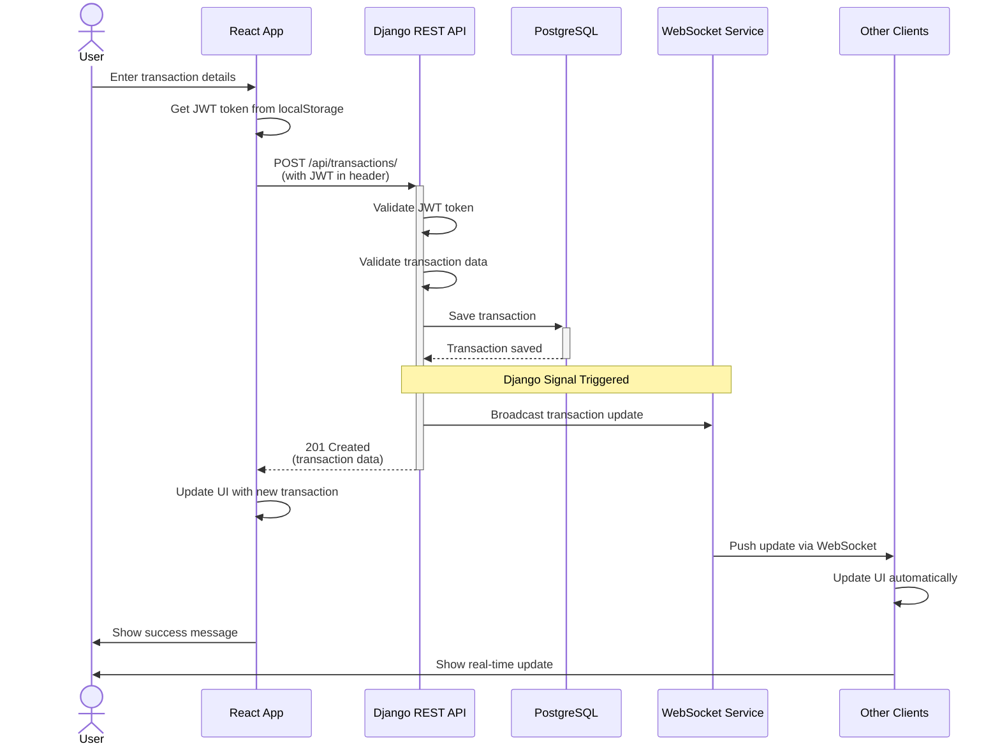

## Recording a Transaction with Real-time Updates

## Description

This sequence diagram illustrates the **interaction flow** when a user records a transaction, showing:

### Components Involved
1. **User** - The person using the application
2. **React App** - Frontend single-page application
3. **Django REST API** - Backend server handling requests
4. **PostgreSQL** - Database storing transaction data
5. **WebSocket Service** - Real-time update broadcaster
6. **Other Clients** - Other devices/tabs connected to the same user account

### Interaction Flow

#### 1. User Input
User enters transaction details (amount, description, category, etc.)

#### 2. Authentication
- React app retrieves JWT token from localStorage
- Token is added to the HTTP request header

#### 3. API Processing
- Django validates the JWT token (authenticates user)
- Validates transaction data (serializer validation)
- Saves transaction to database

#### 4. Real-time Broadcast
- Django signal detects transaction save
- WebSocket service broadcasts update to all connected clients
- Other browser tabs/devices receive instant updates

#### 5. Response
- API returns 201 Created with transaction data
- Original client updates UI
- Other clients automatically update their UI via WebSocket
