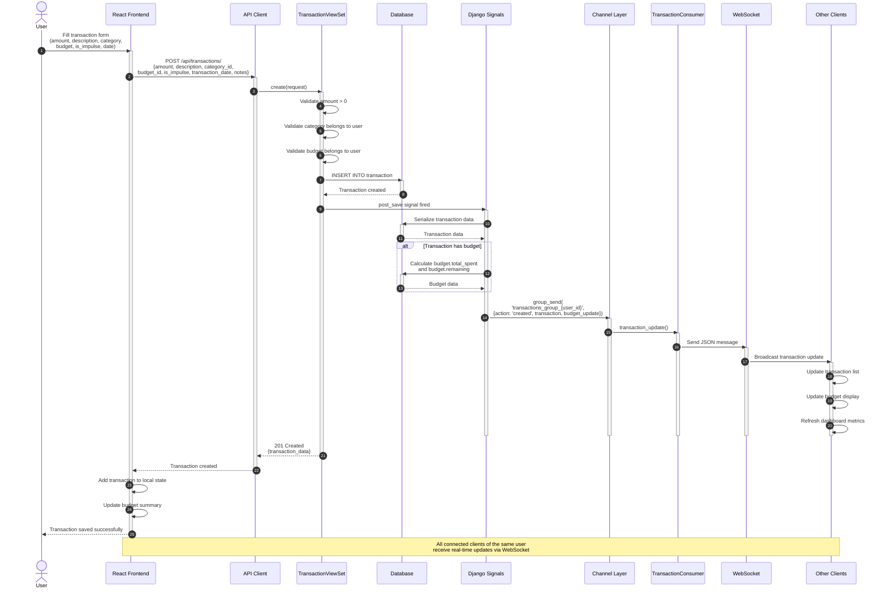

# Impulse - Transaction Creation with Real-time Updates Sequence

## Description

This sequence diagram illustrates the complete flow of creating a transaction with real-time WebSocket updates to all connected clients.

### Key Steps

1. **Form Submission (Steps 1-2)**
   - User fills out transaction form with all details
   - Form submitted to backend API

2. **Validation & Creation (Steps 3-7)**
   - Amount validated (must be > 0)
   - Category ownership validated
   - Budget ownership validated
   - Transaction record created in database

3. **Signal Processing (Steps 8-13)**
   - Django post_save signal automatically triggered
   - Transaction data serialized
   - If budget linked, budget totals recalculated
   - Budget spending and remaining amounts updated

4. **WebSocket Broadcasting (Steps 14-19)**
   - Signal handler sends message to Channel Layer
   - Channel Layer routes to TransactionConsumer
   - Consumer broadcasts to all connected clients
   - Each client in user's group receives update

5. **Client Updates (Steps 20-22)**
   - All connected browser tabs/devices receive update
   - Transaction lists automatically refresh
   - Budget displays update with new totals
   - Dashboard metrics recalculated

6. **Response & UI Update (Steps 23-27)**
   - API returns success response
   - Frontend updates local state
   - Success notification shown to user

### Important Notes

- **Real-time Sync**: All devices/tabs of the same user stay synchronized
- **Signal-Based**: WebSocket broadcasts triggered automatically by Django signals
- **Group Messaging**: Each user has their own WebSocket group (`transactions_group_{user_id}`)
- **Budget Tracking**: When transaction links to budget, all budget metrics update instantly
- **Multi-device**: Changes made on one device appear immediately on all other connected devices
