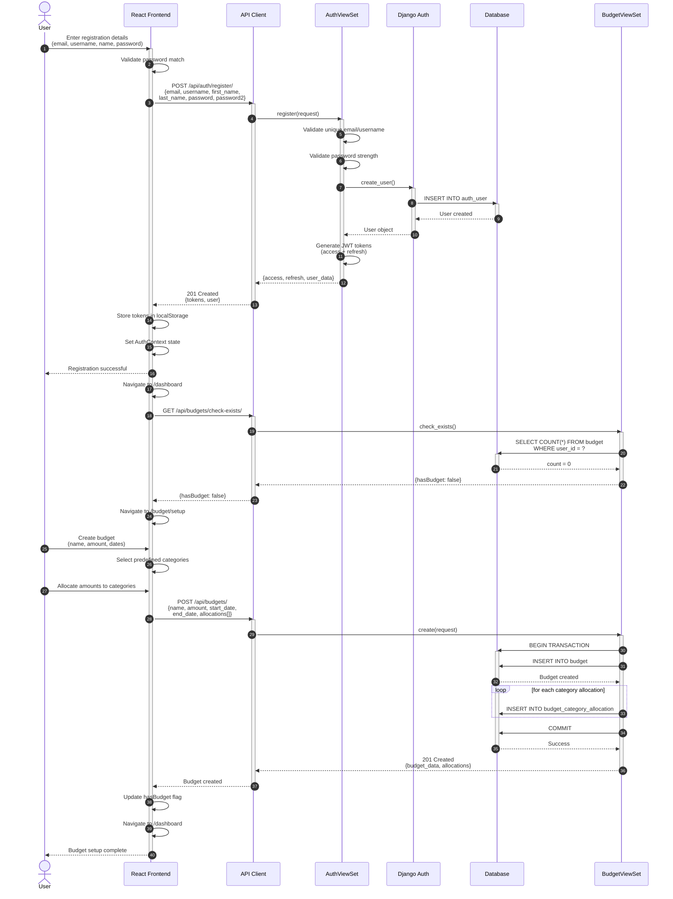

# Impulse - User Registration & Budget Setup Sequence

## Description

This sequence diagram shows the complete flow of user registration and initial budget setup in the Impulse application.

### Key Steps

1. **Registration (Steps 1-11)**
   - User enters registration details
   - Frontend validates password matching
   - Backend validates uniqueness and password strength
   - User record created in database
   - JWT tokens generated and returned

2. **Token Storage (Steps 12-14)**
   - Tokens stored in browser localStorage
   - Authentication context updated
   - User redirected to dashboard

3. **Budget Check (Steps 15-21)**
   - System checks if user has any budgets
   - If no budget exists, redirect to budget setup
   - First-time users must create a budget

4. **Budget Creation (Steps 22-31)**
   - User enters budget details and dates
   - Selects or creates categories
   - Allocates budget amounts to each category
   - Database transaction ensures data integrity
   - Budget and allocations created atomically

### Important Notes

- All database operations for budget creation happen in a transaction
- JWT tokens have different lifetimes: access (1 hour), refresh (7 days)
- New users are automatically redirected to budget setup
- The hasBudget flag determines the user's next destination
