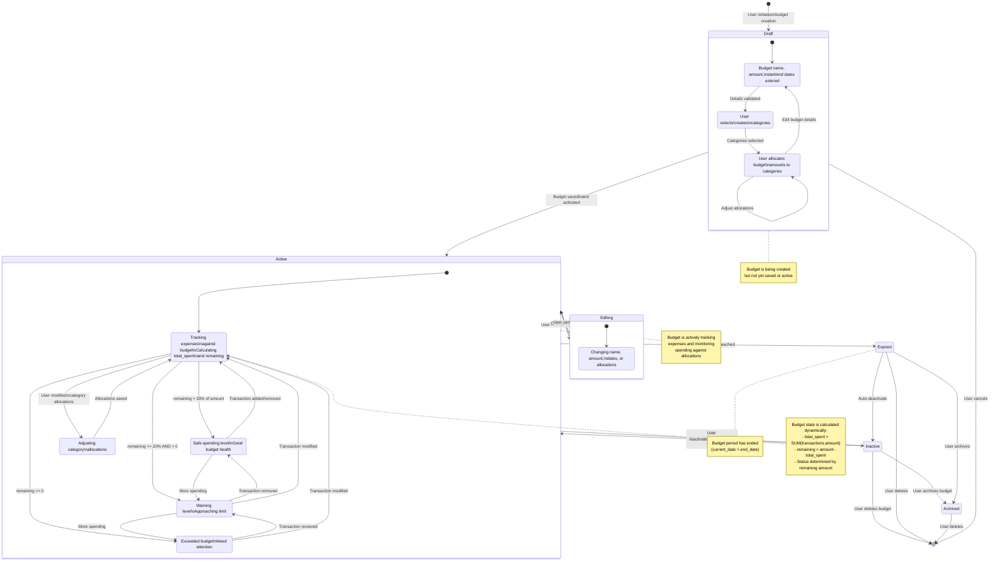

# Impulse - Budget Lifecycle State Diagram



## Description

This state diagram illustrates the complete lifecycle of a budget in the Impulse application, from creation through archival.

### Budget States

#### **Draft**
- Initial state during budget creation
- Sub-states:
  - **EnteringDetails**: User inputs basic budget info
  - **SelectingCategories**: Choosing expense categories
  - **AllocatingAmounts**: Distributing budget across categories
- Can loop between sub-states for refinement
- Exits to Active (saved) or terminates (cancelled)

#### **Active**
Main operational state with dynamic monitoring

**Sub-states:**
- **Monitoring**: Default active state, tracking all expenses
- **UnderBudget**: remaining > 20% of budget amount
  - Green/safe zone
  - Normal spending levels
- **AtRisk**: remaining ≤ 20% but > 0
  - Yellow/warning zone
  - Approaching budget limit
- **OverBudget**: remaining ≤ 0
  - Red/danger zone
  - Exceeded budget amount
- **EditingAllocations**: Modifying category allocations

**Dynamic Calculations:**
```python
total_spent = sum(transaction.amount for all linked transactions)
remaining = budget.amount - total_spent
```

**State Transitions:**
- Transactions automatically trigger state recalculation
- Adding/removing/modifying transactions moves between UnderBudget/AtRisk/OverBudget
- User can edit allocations without leaving Active state

#### **Editing**
- User modifying budget details (name, amount, dates)
- Returns to Active when saved or cancelled

#### **Inactive**
- Budget deactivated by user (is_active = false)
- Can be reactivated
- Can be archived or deleted
- Expired budgets auto-transition here

#### **Expired**
- Temporary state when end_date reached
- System marks budget as expired
- User decides to keep inactive, archive, or delete

#### **Archived**
- Budget preserved for historical reference
- Cannot be reactivated
- Only action: delete

### State Transitions

| From | To | Trigger |
|------|-----|---------|
| Draft | Active | User saves budget |
| Draft | [*] | User cancels creation |
| Active | Expired | System: end_date reached |
| Active | Inactive | User deactivates |
| Active | Editing | User clicks edit |
| Editing | Active | User saves changes |
| Inactive | Active | User reactivates |
| Inactive | Archived | User archives |
| Expired | Inactive | Auto-deactivate |
| Archived | [*] | User deletes |

### Important Notes

- **Dynamic Health**: Budget health (UnderBudget/AtRisk/OverBudget) calculated in real-time
- **Transaction Impact**: Every transaction immediately updates budget state
- **Reversible Actions**: Most state changes are reversible (except delete)
- **Date-Based Expiry**: System automatically expires budgets past end_date
- **Archival**: Preserves historical data while preventing accidental reactivation
- **is_active Flag**: Database boolean determines Active vs Inactive state
