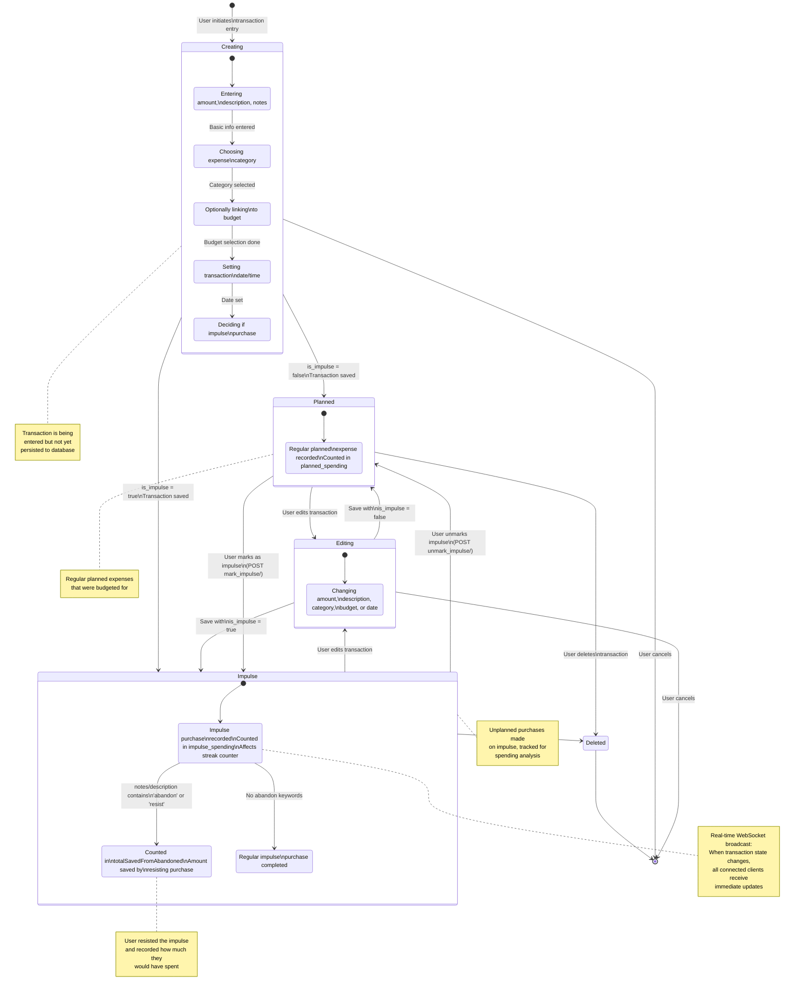

# Impulse - Transaction State Diagram



## Description

This state diagram shows the lifecycle and state transitions of transactions in the Impulse application, with special focus on impulse purchase tracking.

### Transaction States

#### **Creating**
Initial state during transaction entry

**Sub-states:**
1. **FillingForm**: Entering basic transaction info (amount, description, notes)
2. **SelectingCategory**: Choosing which category this expense belongs to
3. **SelectingBudget**: Optionally linking to a budget for tracking
4. **SettingDate**: Setting when the transaction occurred
5. **MarkingImpulse**: Deciding if this was an impulse purchase

**Exit conditions:**
- Save as Planned (is_impulse = false)
- Save as Impulse (is_impulse = true)
- Cancel (delete draft)

#### **Planned**
Regular, expected expenses

**Characteristics:**
- is_impulse = false
- Counted in planned_spending metrics
- Expected expenses that fit within budget
- Normal financial management

**Sub-state:**
- **Recorded**: Transaction persisted to database

#### **Impulse**
Unplanned, spontaneous purchases

**Characteristics:**
- is_impulse = true
- Counted in impulse_spending metrics
- Affects impulse streak counter
- Tracked separately for analysis

**Sub-states:**
- **RecordedAsImpulse**: Initial impulse state
- **Abandoned**: Contains "abandon" or "resist" keywords
  - Money saved by not making purchase
  - Counted in totalSavedFromAbandoned metric
  - Heuristic detection via keywords
- **NotAbandoned**: Completed impulse purchase
  - Actually spent money
  - Full impulse transaction

**Keyword Detection:**
```python
abandoned = (
    'abandon' in notes.lower() or
    'abandon' in description.lower() or
    'resist' in notes.lower() or
    'resist' in description.lower()
)
```

#### **Editing**
User modifying transaction details

**Capabilities:**
- Change amount, description, notes
- Change category
- Change budget link
- Change date
- Toggle impulse flag

**Exit conditions:**
- Save with is_impulse = false → Planned
- Save with is_impulse = true → Impulse
- Cancel → return to previous state

#### **Deleted**
Transaction removed from system

**Characteristics:**
- Permanent deletion
- Removed from all calculations
- Cannot be recovered
- Final state → termination

### State Transitions

| From | To | Trigger | Method |
|------|-----|---------|--------|
| Creating | Planned | User saves with is_impulse=false | POST /api/transactions/ |
| Creating | Impulse | User saves with is_impulse=true | POST /api/transactions/ |
| Planned | Editing | User clicks edit | Frontend navigation |
| Impulse | Editing | User clicks edit | Frontend navigation |
| Editing | Planned | Save with is_impulse=false | PUT /api/transactions/{id}/ |
| Editing | Impulse | Save with is_impulse=true | PUT /api/transactions/{id}/ |
| Planned | Impulse | Mark as impulse | POST /api/transactions/{id}/mark_impulse/ |
| Impulse | Planned | Unmark impulse | POST /api/transactions/{id}/unmark_impulse/ |
| Planned | Deleted | User deletes | DELETE /api/transactions/{id}/ |
| Impulse | Deleted | User deletes | DELETE /api/transactions/{id}/ |

### Real-time Updates

Every state change triggers:
1. **Django Signal**: post_save or post_delete
2. **WebSocket Broadcast**: Message to user's transaction group
3. **Client Updates**: All connected devices receive update
4. **Metric Recalculation**: Dashboard metrics automatically refresh

### Important Notes

- **Impulse Detection**: Boolean flag stored in database
- **Abandoned Detection**: Heuristic-based, not stored as separate flag
- **Reclassification**: Users can toggle between Planned and Impulse states
- **Analytics Impact**: State affects multiple dashboard metrics
- **Budget Impact**: When linked to budget, state changes update budget totals
- **Multi-device Sync**: Real-time updates ensure consistency across devices

### Use Cases

**Planned Transaction:**
```
Creating → Planned → (stays Planned)
Use: Regular bills, groceries, expected expenses
```

**Impulse Purchase - Completed:**
```
Creating → Impulse (NotAbandoned)
Use: Made an unplanned purchase, want to track it
```

**Impulse Purchase - Resisted:**
```
Creating → Impulse (Abandoned)
Use: Considered buying but resisted, track savings
```

**Reclassification:**
```
Planned → Impulse or Impulse → Planned
Use: Initially misclassified, correcting the record
```
