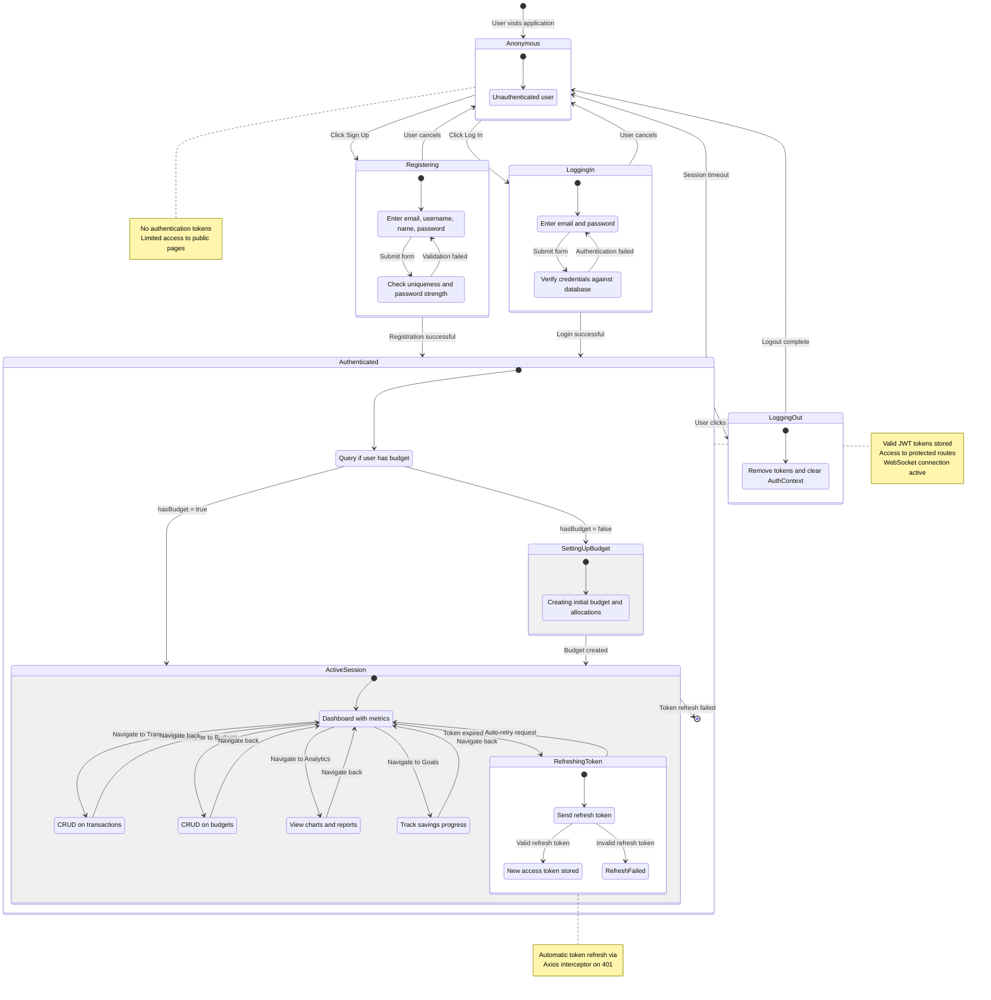

# Impulse - User Session State Diagram

## Description

This state diagram illustrates the complete user session lifecycle in the Impulse application, from anonymous visitor to authenticated user with automatic token management.

### Session States

#### **Anonymous**
Initial state for unauthenticated users

**Characteristics:**
- No JWT tokens
- Limited access (public pages only)
- Can view login/registration pages
- No access to protected routes

**Available Actions:**
- Navigate to registration
- Navigate to login
- View public content

#### **Registering**
User creating new account

**Sub-states:**
1. **EnteringCredentials**: User inputs registration details
   - Email, Username, First name, Last name, Password

2. **ValidatingCredentials**: Backend validation
   - Email uniqueness check
   - Username uniqueness check
   - Password strength validation
   - Password match confirmation

**Exit conditions:**
- Success → Authenticated (with tokens)
- Failure → Loop back to EnteringCredentials
- Cancel → Return to Anonymous

#### **LoggingIn**
User authenticating with existing account

**Sub-states:**
1. **EnteringLoginDetails**: User inputs email and password
2. **Authenticating**: Backend verification (email lookup, password hash comparison)

**Exit conditions:**
- Success → Authenticated (with tokens)
- Failure → Loop back to EnteringLoginDetails
- Cancel → Return to Anonymous

#### **Authenticated**
User successfully logged in with valid tokens

**Token Storage:**
- Access token (1 hour lifetime) → localStorage
- Refresh token (7 days lifetime) → localStorage
- AuthContext populated

**Sub-states:**

##### 1. **CheckingBudgetStatus**
- Queries backend: Does user have budget?
- Determines next destination

##### 2. **SettingUpBudget** (if hasBudget = false)
- First-time user experience
- Mandatory budget creation
- Creates initial budget with allocations
- Upon completion → ActiveSession

##### 3. **ActiveSession** (if hasBudget = true)
Main application usage state with full features:
- **ViewingDashboard**: Default view with metrics
- **ManagingTransactions**: CRUD operations on transactions
- **ManagingBudgets**: Budget management
- **ViewingAnalytics**: Charts and reports
- **ManagingSavingsGoals**: Savings tracking
- **RefreshingToken**: Automatic token refresh on expiry

**Features:**
- Full CRUD capabilities
- WebSocket connection active
- Real-time updates
- Auto-refresh on data changes

**Token Refresh Flow:**
When access token expires (401 response):
- **RequestingNewToken**: Sends refresh token to backend
- **TokenRefreshed**: New access token received
  - Update localStorage
  - Retry original request
  - Return to active state
- **RefreshFailed**: Refresh token invalid/expired
  - Clear tokens
  - Exit to Anonymous

#### **LoggingOut**
User-initiated logout

**Actions:**
1. **ClearingTokens**:
   - Remove access token from localStorage
   - Remove refresh token from localStorage
   - Clear AuthContext
   - Close WebSocket connection

**Exit:**
- Returns to Anonymous state
- User must login again for access

### State Transitions

| From | To | Trigger |
|------|-----|---------|
| Anonymous | Registering | Click "Sign Up" |
| Anonymous | LoggingIn | Click "Log In" |
| Registering | Authenticated | Successful registration |
| Registering | Anonymous | Cancel |
| LoggingIn | Authenticated | Successful login |
| LoggingIn | Anonymous | Cancel |
| Authenticated | SettingUpBudget | hasBudget = false |
| Authenticated | ActiveSession | hasBudget = true |
| SettingUpBudget | ActiveSession | Budget created |
| ActiveSession | RefreshingToken | 401 response (token expired) |
| RefreshingToken | ActiveSession | Refresh successful |
| RefreshingToken | Anonymous | Refresh failed |
| Authenticated | LoggingOut | User clicks logout |
| Authenticated | Anonymous | Session timeout |
| LoggingOut | Anonymous | Tokens cleared |

### Token Management

**Access Token:**
- Lifetime: 1 hour
- Stored in: localStorage
- Used in: Authorization header for all API requests
- Auto-refresh: Yes, via Axios interceptor

**Refresh Token:**
- Lifetime: 7 days
- Stored in: localStorage
- Used in: Token refresh endpoint only
- Auto-refresh: No (user must login again after expiry)

**Refresh Flow:**
1. API request with access token
2. Backend returns 401 (token expired)
3. Axios interceptor catches 401
4. Retrieves refresh token from localStorage
5. Sends refresh token to /api/auth/refresh/
6. Receives new access token
7. Updates localStorage
8. Retries original request with new token
9. Returns response to frontend

### Important Notes

- **Transparent Refresh**: Token refresh happens automatically, invisible to user
- **Multi-tab Support**: localStorage accessible across tabs (shared session)
- **Security**: Short-lived access tokens minimize exposure risk
- **Persistence**: Refresh token allows 7-day sessions without re-login
- **Budget Requirement**: New users must create budget before accessing main app
- **WebSocket**: Connection established in ActiveSession, closed on logout
- **Interceptor Pattern**: Single Axios interceptor handles all 401 responses globally

### Security Features

1. **JWT Stateless**: No server-side session storage
2. **Token Rotation**: Access token refreshed regularly
3. **Automatic Expiry**: Both tokens have defined lifetimes
4. **Secure Storage**: Tokens in localStorage (consider httpOnly cookies for production)
5. **Logout Cleanup**: All client-side tokens cleared on logout
