# Impulse - Use Case Diagram

```mermaid
graph TB
    %% Actors
    User([User])
    System([System])

    %% Authentication
    subgraph Authentication
        UC1[Register Account]
        UC2[Login]
        UC3[Logout]
        UC4[Refresh Token]
        UC5[View Profile]
    end

    %% Budget Management
    subgraph Budget_Management["Budget Management"]
        UC6[Create Budget]
        UC7[View Budgets]
        UC8[Edit Budget]
        UC9[Delete Budget]
        UC10[Set Category Allocations]
        UC11[View Budget Summary]
        UC12[Check Active Budget]
    end

    %% Transaction Management
    subgraph Transaction_Management["Transaction Management"]
        UC13[Record Transaction]
        UC14[View Transactions]
        UC15[Edit Transaction]
        UC16[Delete Transaction]
        UC17[Mark as Impulse Purchase]
        UC18[Unmark Impulse Purchase]
        UC19[Filter Transactions]
        UC20[View Recent Transactions]
    end

    %% Category Management
    subgraph Category_Management["Category Management"]
        UC21[Create Category]
        UC22[View Categories]
        UC23[Edit Category]
        UC24[Delete Category]
        UC25[Bulk Create Categories]
        UC26[View Category Statistics]
    end

    %% Savings Goals
    subgraph Savings_Goals["Savings Goals"]
        UC27[Create Savings Goal]
        UC28[View Savings Goals]
        UC29[Edit Savings Goal]
        UC30[Delete Savings Goal]
        UC31[Add Progress to Goal]
        UC32[View Goal Summary]
    end

    %% Analytics & Reports
    subgraph Analytics_Reports["Analytics & Reports"]
        UC33[View Dashboard]
        UC34[View Spending by Category]
        UC35[View Spending Trends]
        UC36[Analyze Impulse Purchases]
        UC37[View Monthly Summary]
        UC38[Compare Monthly Spending]
        UC39[View Yearly Breakdown]
        UC40[View Category Trends]
        UC41[Compare Budget vs Actual]
        UC42[View Spending Heatmap]
        UC43[View Custom Time Range]
    end

    %% Real-Time Updates
    subgraph Real_Time["Real-Time Updates"]
        UC44[Receive Transaction Updates]
        UC45[Receive Budget Updates]
    end

    %% User relationships
    User --> UC1
    User --> UC2
    User --> UC3
    User --> UC4
    User --> UC5

    User --> UC6
    User --> UC7
    User --> UC8
    User --> UC9
    User --> UC10
    User --> UC11
    User --> UC12

    User --> UC13
    User --> UC14
    User --> UC15
    User --> UC16
    User --> UC17
    User --> UC18
    User --> UC19
    User --> UC20

    User --> UC21
    User --> UC22
    User --> UC23
    User --> UC24
    User --> UC25
    User --> UC26

    User --> UC27
    User --> UC28
    User --> UC29
    User --> UC30
    User --> UC31
    User --> UC32

    User --> UC33
    User --> UC34
    User --> UC35
    User --> UC36
    User --> UC37
    User --> UC38
    User --> UC39
    User --> UC40
    User --> UC41
    User --> UC42
    User --> UC43

    %% System relationships (automated)
    System --> UC44
    System --> UC45

    %% Include relationships
    UC6 -.->|include| UC21
    UC6 -.->|include| UC10
    UC13 -.->|include| UC22
    UC13 -.->|include| UC7
    UC33 -.->|include| UC37
    UC33 -.->|include| UC34
    UC11 -.->|include| UC10

    %% Extend relationships
    UC17 -.->|extend| UC13
    UC18 -.->|extend| UC13
    UC19 -.->|extend| UC14
    UC44 -.->|extend| UC14
    UC45 -.->|extend| UC11

    style User fill:#e1f5ff,stroke:#01579b
    style System fill:#fff3e0,stroke:#e65100
```

## Description

This use case diagram illustrates all the functional requirements and user interactions in the Impulse application.

### Use Case Categories

#### 1. **Authentication** (5 use cases)
- User registration, login, logout, token management, and profile viewing

#### 2. **Budget Management** (7 use cases)
- Complete budget lifecycle from creation to monitoring
- Category allocation management
- Budget status checking and summaries

#### 3. **Transaction Management** (8 use cases)
- Record, view, edit, and delete transactions
- Special impulse purchase marking/unmarking
- Filtering and recent transaction views

#### 4. **Category Management** (6 use cases)
- CRUD operations for expense categories
- Bulk creation for initial setup
- Category-based spending statistics

#### 5. **Savings Goals** (6 use cases)
- Create and track savings goals
- Add progress toward goals
- View goal summaries and completion status

#### 6. **Analytics & Reports** (11 use cases)
- Comprehensive spending analysis
- Multiple time ranges (weekly, monthly, yearly)
- Budget vs actual comparisons
- Impulse purchase analysis
- Interactive visualizations

#### 7. **Real-Time Updates** (2 use cases)
- Automated WebSocket broadcasts
- Multi-device synchronization

### Key Relationships

- **Include**: UC6 (Create Budget) includes UC21 (Create Category) and UC10 (Set Category Allocations)
- **Extend**: UC17 (Mark as Impulse) extends UC13 (Record Transaction)
- **Automated**: Real-time updates are triggered by the system, not the user

### Notes

- **Impulse Tracking**: Users can mark transactions as impulse purchases to track spending patterns
- **Real-Time Sync**: WebSocket updates ensure all connected clients receive immediate updates
- **Dashboard Integration**: The dashboard aggregates multiple analytics endpoints for a unified view
