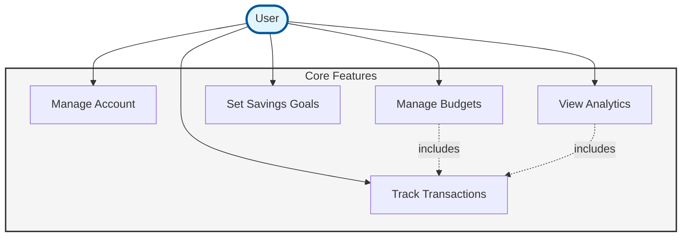

## Use Case Diagram

This use case diagram shows the **5 core features** of the Impulse application:

1. **Manage Account** - Register, login, logout, profile management
2. **Manage Budgets** - Create and edit budgets with category allocations
3. **Track Transactions** - Record, categorize, and mark impulse purchases
4. **Set Savings Goals** - Create goals and track progress
5. **View Analytics** - Dashboard, spending trends, and reports